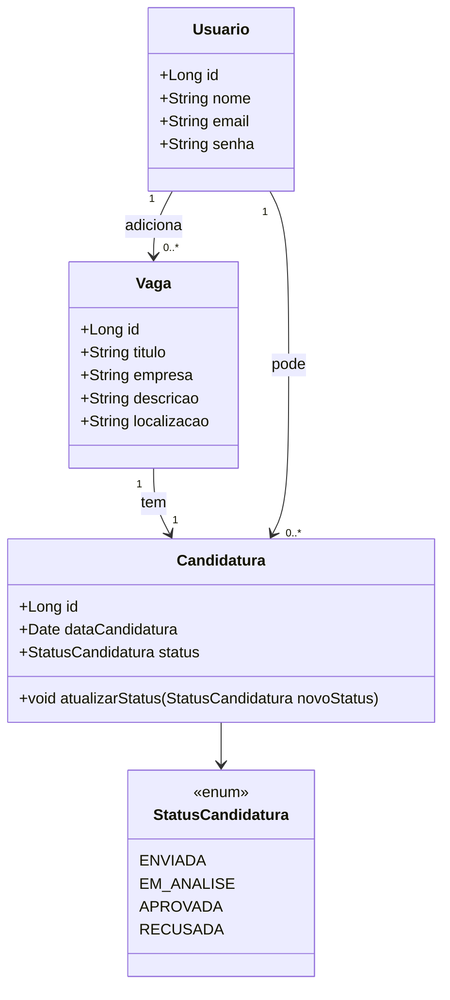

# MinhasCandidaturas

# 📌 API de Candidaturas

Esta é uma API REST desenvolvida para gerenciar **usuários**, **vagas** e **candidaturas** em um processo seletivo. Permite que candidatos se cadastrem, se candidatem a vagas e acompanhem o status de suas candidaturas.

---

## 🚀 Tecnologias Utilizadas

- **Java 17**
- **Spring Boot**
- **Spring Data JPA**
- **Spring Security** (Token JWT)
- **PostgreSQL**
- **Maven**
- **Lombok**
- **Docker**

---

## 🛠️ Como executar o projeto

### Pré-requisitos

- Java 17
- Maven 3.8+
- PostgreSQL rodando com banco de dados configurado
- IDE de sua preferência (IntelliJ, VSCode, etc)

### Passos para rodar:

```bash
# Clone o repositório
git clone https://github.com/seu-usuario/api-candidaturas.git

# Acesse o diretório
cd api-candidaturas

# Configure o application.properties (src/main/resources)
spring.datasource.url=jdbc:postgresql://localhost:5432/seu_banco
spring.datasource.username=seu_usuario
spring.datasource.password=sua_senha
jwt.secret=sua_chave_secreta

# Compile e execute
./mvnw spring-boot:run
```

## Diagrama


