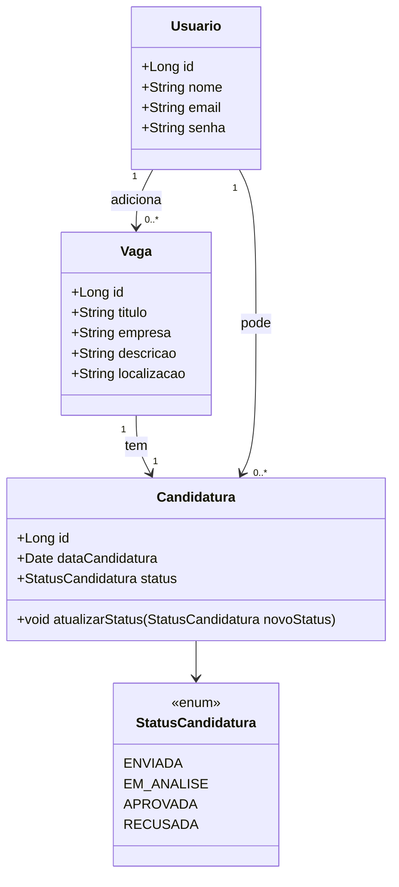

# MinhasCandidaturas

```mermaid
classDiagram
    class Usuario {
        +Long id
        +String nome
        +String email
        +String senha
    }

    class Vaga {
        +Long id
        +String titulo
        +String empresa
        +String descricao
        +String localizacao
    }

    class Candidatura {
        +Long id
        +Date dataCandidatura
        +StatusCandidatura status
        +void atualizarStatus(StatusCandidatura novoStatus)
    }

    class StatusCandidatura {
        <<enum>>
        ENVIADA
        EM_ANALISE
        APROVADA
        RECUSADA
    }

    Usuario "1" --> "0..*" Vaga : adiciona
    Vaga "1" --> "1" Candidatura : tem
    Candidatura --> StatusCandidatura
    Usuario "1" --> "0..*" Candidatura: pode

```
